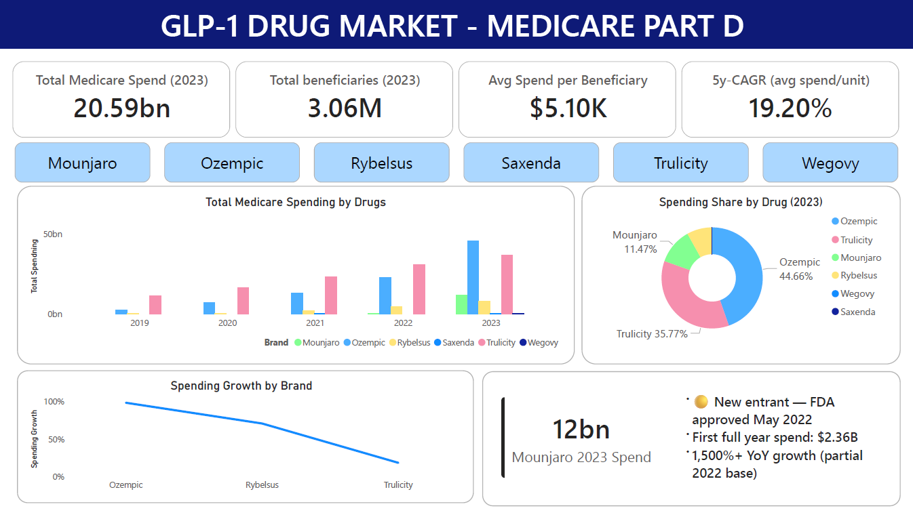
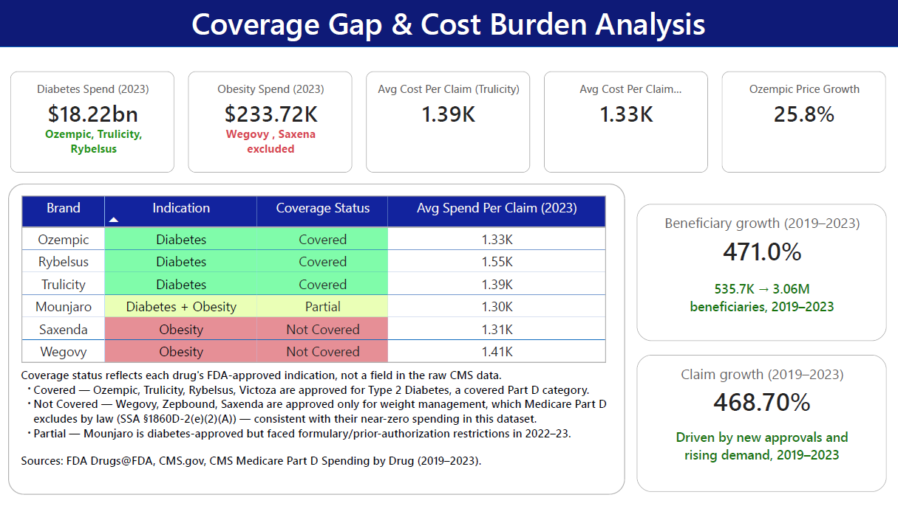
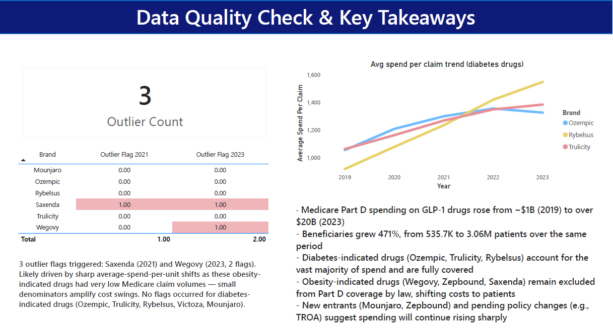

# GLP-1 Drug Market Impact Analysis

# GLP-1 Drug Market Impact Analysis

Medicare Part D spending, beneficiary growth, and coverage gap analysis for the GLP-1 drug class (Ozempic, Wegovy, Mounjaro, Zepbound, Trulicity, Rybelsus, Saxenda, Victoza), 2019–2023.

## Overview

GLP-1 drugs have become one of the fastest-growing and most expensive categories of U.S. prescription drug spending, and the subject of ongoing policy debate over whether Medicare should cover obesity treatment in addition to diabetes treatment. This project analyzes five years of real CMS spending data to quantify that growth and the coverage gap behind it, using a full Python → Power BI analytics workflow.

**Key result:** Medicare Part D spending on GLP-1 drugs rose from ~$1B (2019) to over $20B (2023), with beneficiaries growing 471% (535.7K → 3.06M) — while obesity-indicated drugs remained almost entirely excluded from Part D coverage by law.

## Key Questions

- How has total Medicare Part D spending on GLP-1 drugs changed from 2019 to 2023?
- Is spending growth driven by more patients, higher cost per patient, or both?
- Which GLP-1 drugs are covered by Medicare Part D, and which are excluded by law?
- What is the financial impact of the coverage gap between diabetes- and obesity-indicated drugs?
- Were any statistically unusual spending patterns flagged in the underlying data?

## Data Source

[CMS Medicare Part D Spending by Drug](https://data.cms.gov/summary-statistics-on-use-and-payments/medicare-medicaid-spending-by-drug) — a public dataset published by the Centers for Medicare & Medicaid Services.

| Attribute | Detail |
|---|---|
| Raw size | 14,309 rows × 46 columns (all Part D drugs nationally) |
| Coverage period | 2019–2023 |
| Granularity | One row per drug, with yearly metrics in separate columns |
| Key metrics | Total spending, claims, beneficiaries, dosage units, average spend per claim/beneficiary/unit, CMS outlier flags |
| Known limitation | Gross drug cost only — excludes manufacturer rebates (CMS is statutorily barred from disclosing these) |

> **Scope note:** This data reflects what Medicare paid (insurer + patient share combined) — not hospital purchasing costs, state-level breakdowns, or private insurance data.

## Workflow

**1. Data cleaning (Python / pandas)**
- Dropped non-relevant columns (`Tot_Mftr`, `Mftr_Name`, pre-calculated CMS change/CAGR fields)
- Removed 2,201 exact duplicate rows; investigated and correctly retained legitimate multi-row brand/generic entries
- Resolved nulls by cause rather than blanket imputation — zero-activity years filled with 0, CMS privacy-suppressed beneficiary counts (<11 patients) left as `NaN` and reviewed by drug
- Filtered to the 8 GLP-1 drugs in scope

**2. Feature engineering (Python / pandas)**
- `Spending_Growth_%`, `Beneficiary_Growth_%`, `Claim_Growth_%`, `Price_Change_%` (2019→2023, with divide-by-zero guards)
- `Top10_Drug`, `New_Drug` flags
- `Avg_5Y_Spending`, `Spending_Volatility` (mean/std across all 5 years)
- Exploratory matplotlib charts (top-10 spending, multi-year trend lines, distribution histogram, beneficiaries-vs-spending scatter) to validate findings before dashboarding

**3. Data modeling (Power BI / Power Query)**
- One wide base table (`glp`) for KPI cards and DAX measures
- Three purpose-built long (unpivoted) reference tables for trend charts: `glp long`, `glp long (2)`, `clm glp`
- Calculated columns for `Indication` and `Coverage_Status`, mapping each drug to its FDA-approved use and resulting Part D coverage status

**4. Measures (DAX)**
- 5-year CAGR, YoY and multi-year growth measures with zero-division guards
- Per-drug spend isolation (`Diabetes_Spend_2023`, `Obesity_Spend_2023`, `Ozempic_Avg_Clm_2023`, etc.)
- Outlier flag aggregation across all years

## Dashboard

A 3-page Power BI report:

**Page 1 — Total Medicare Spending Overview**
KPI cards (total beneficiaries, avg spend/beneficiary, 5-year CAGR, total spend), spending trend by drug, 2023 spending-share donut, YoY growth by drug, and a dedicated callout for Mounjaro's launch-year distortion.

**Page 2 — Coverage Gap & Cost Burden Analysis**
Diabetes vs. obesity spend comparison, color-coded coverage-status table, average cost-per-claim KPIs, and beneficiary/claim growth cards with sourced methodology footnotes.

**Page 3 — Data Quality Check & Key Takeaways**
Average cost-per-claim trend for diabetes drugs, CMS outlier flag breakdown by drug/year, and a summary of key findings.

## Key Findings

- Medicare Part D spending on GLP-1 drugs rose from ~$1B (2019) to over $20B (2023)
- Beneficiaries grew 471%, from 535.7K to 3.06M patients
- Diabetes-indicated drugs (Ozempic, Trulicity, Rybelsus) drove the vast majority of spend ($18.22bn in 2023) and are fully covered
- Obesity-indicated drugs (Wegovy, Zepbound, Saxenda) remain excluded from Part D coverage by statute — 2023 spend was just $233.72K
- Ozempic's average cost per claim grew 25.8% from 2019–2023, showing price inflation alongside patient growth
- Only 3 CMS outlier flags were triggered in the entire window, both tied to low-volume obesity drugs (Saxenda, Wegovy)

## Methodology Notes & Limitations

- Coverage status (`Covered` / `Partial` / `Not Covered`) and `Indication` are analyst-derived from FDA-approved indications and Medicare statute (SSA §1860D-2(e)(2)(A)) — not fields present in the raw CMS data
- Mounjaro's YoY spending growth (1,500%+) is mathematically accurate but reflects a partial 2022 launch year vs. a full 2023 year; it's excluded from the standard YoY chart and shown as a standalone, labeled finding instead
- State-level adoption is out of scope, since this dataset reports national totals only

## Sources

- [CMS Medicare Part D Spending by Drug](https://data.cms.gov/summary-statistics-on-use-and-payments/medicare-medicaid-spending-by-drug)
- [FDA Drugs@FDA](https://www.accessdata.fda.gov/scripts/cder/daf/)
- Social Security Act §1860D-2(e)(2)(A) — Medicare Part D statutory exclusion of weight-loss agents
